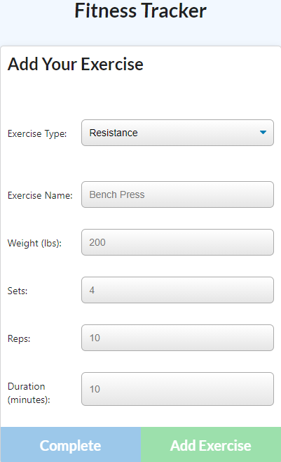

# Workout Tracker
  ## README created by: MrBusiness87

  
  
  ---
  ## Table of Contents:
  * [Title](#Title)
  * [Description](#Description)
  * [Installation](#Installation)
  * [Usage](#Usage)
  * [Questions](#Questions)
  

  ---
  

  ### Title:
  Workout Tracker
  
  &nbsp;&nbsp;&nbsp;

  ### Description:
  The application helps the user keep up with any workout they would like. The workout has to be Cardio or Resistance workout. Once you choose your first option the rest will fall suite, just fill in the spaces and add or complete your workout. Once you have added or completed your workout it will be displayed on the Dashboard part of the website.
  
  &nbsp;&nbsp;&nbsp;

  ### Installation:
  The command to install dependencies is: Express and Mongoose through NPM, and also used MongoDB and Heroku for deployment purposes.. 
  Use the SSH key in the Repository and download the application on your local drive. You will need MongoDB and Heroku Access to manipulate the application for any other uses and deployment.
  

  ### Usage:
  Keep track of exercises done in the past.
  

  ### Running Application:
  To run the application you will need to use npm start if you are running it locally.  Otherwise, just use the heroku deployment link: <a href="https://workout-tracker-bb.herokuapp.com/">CLICK HERE TO HEROKU DEPLOY!</a>
  
  ---
  ### Questions:
  * GitHub Page: https://github.com/MrBusiness87
  * Please send an email to: bbartula87@gmail.com, with any Questions/Concerns/Comments!
  